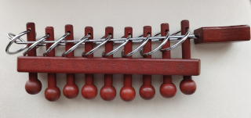
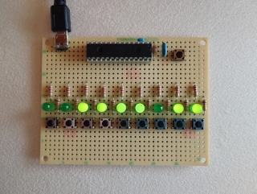
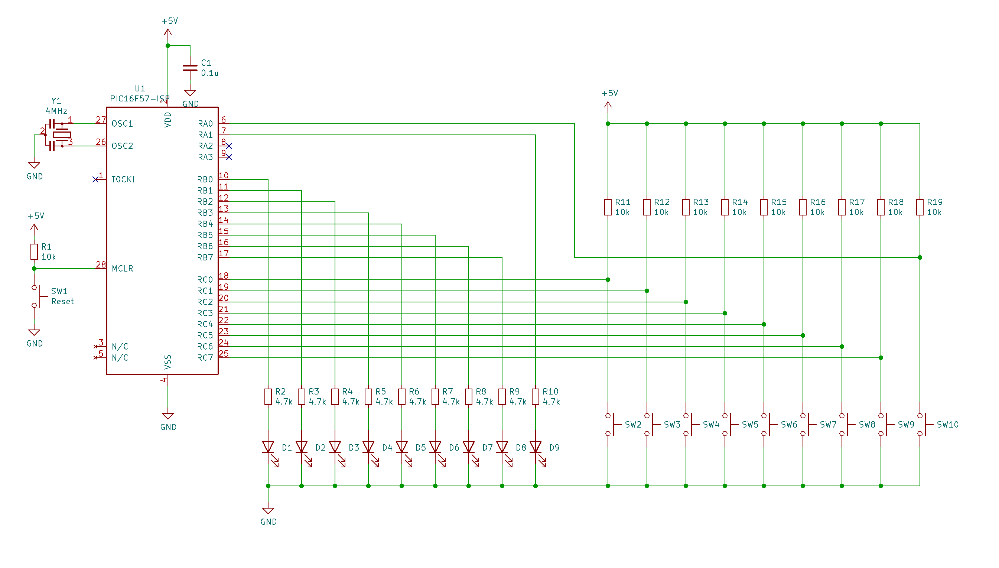

# Chinese nine rings
## Overview
Chinese nine rings is a puzzle that is said to have originated in ancient China.
Nine metal rings are attached to the elongated body, and another elongated ring remove from the nine rings and attache again for play.  
  
  
  
This project is an electronic simulation of this puzzle. By pressing the tact switches, you can turn on and off a LED as if you are passing the ring through or out.  
  
  
  

## Circuitdiagram
It is simple, 9 LEDs and 9 tact switches are connected to baseline PIC16F57.  
If you want to modify take care must not to exceed 50mA total current for each output port.
  
  
  

## BOM
1. Microchip PIC16F57  
2. IC (28p) socket  
3. LED x 9  
4. tact switch x 10  
5. resistor 12k ohm x 10  
5. resistor 2.2k ohm x 9  
6. capacitor 0.1uF x 1  
7. resonator 4MHz x 1  
8. power connector  
printed circuit board and other if you need...  

## Programming
Build the project with MPLAB XC8 Assembler.  
You also need a programming tool like Microchip Pickit(TM).

## To solve
Your mission is to turn on all LEDs, and then turn off all LEDs.  
There are one or two correct switches on each step. Pressing the correct switch toggles the corresponding LED on/off state. Whether the LED can be turned on/off depends on the state of other LEDs. No random elements. Everything works as logical.
